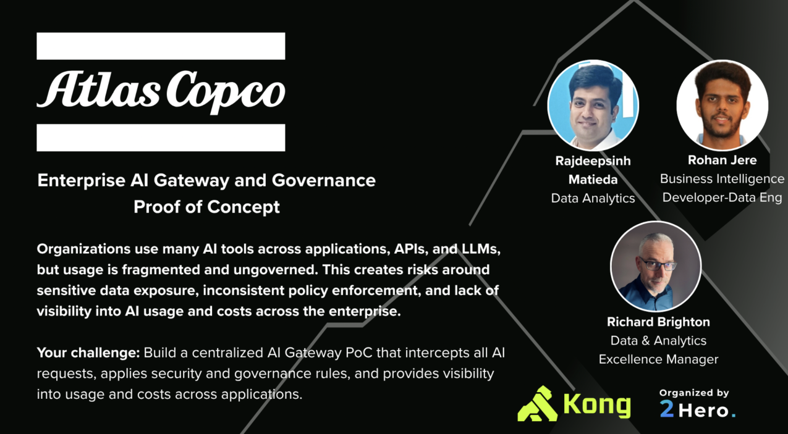

# Enterprise AI Gateway and Governance | Proof of Concept

[](https://opensource.org/licenses/MIT)
[](https://www.typescriptlang.org/)
[](https://konghq.com/)

**Atlas Copco** hackathon challenge, organized by **2Hero**, powered by **Kong**.



## The Challenge

> Organizations use many AI tools across applications, APIs, and LLMs, but usage is fragmented and ungoverned. This creates risks around sensitive data exposure, inconsistent policy enforcement, and lack of visibility into AI usage and costs across the enterprise.
>
> Build a centralized AI Gateway PoC that intercepts all AI requests, applies security and governance rules, and provides visibility into usage and costs across applications.

## The Problem

Organizations today use AI across many applications, teams, and workflows. But most of this usage is ungoverned.

- Anyone can send any data to an LLM, including sensitive information like SSNs, emails, or proprietary business data
- There is no visibility into which teams are using AI, how much they are spending, or what they are asking
- There is no way to enforce budgets, rate limits, or access controls across AI usage
- Compliance teams have no audit trail of what was sent to AI models

This creates serious risks around data exposure, cost overruns, and regulatory non-compliance (EU AI Act).

## What This Project Does

This is a centralized AI gateway that sits between all applications and the LLM. Every AI request must pass through the gateway, which applies security rules, tracks costs, and logs everything.

Think of it as a **firewall for AI**. Just like you wouldn't let employees access the internet without a firewall, you shouldn't let apps access AI models without a governance gateway.

## Architecture

```
Browser (localhost:3000)
      |
      v
Kong API Gateway (localhost:8000)
      |
      +-- key-auth              Validate API key, identify team/consumer
      +-- rate-limiting          Per-consumer request quotas
      +-- request-size-limiting  Block oversized payloads (1MB max)
      +-- bot-detection          Block automated abuse
      +-- cors                   Allow browser cross-origin requests
      +-- ai-prompt-guard        Block prompts with PII patterns (SSN, credit card, personnummer)
      +-- ai-rate-limiting       Token/cost based LLM quotas per consumer
      +-- response-transformer   Inject X-Governance-* headers
      |
      v
Governance Gateway (localhost:8001, Express + TypeScript)
      |
      +-- Auth Middleware        Map API key to team + app identity
      +-- PII Blocker           Deep scan: sensitive, maskable, keyword patterns
      +-- Budget Tracker         Per-team monthly spend limits
      +-- Smart Router           Simple prompts -> small model, complex -> large model
      +-- API Detector           Detect business questions, inject real data as context
      +-- Audit Logger           Write every request to SQLite for governance dashboard
      |
      v
LLM Provider (Cerebras API)
      +-- small: llama3.1-8b
      +-- large: qwen-3-235b-a22b
```

**Two layers of governance:** Kong handles infrastructure concerns (auth, rate limits, prompt guard) while the Express gateway handles business logic (PII masking, budgets, model routing, audit logging).

## Example Scenarios

| You ask | What happens |
|---|---|
| "What is Atlas Copco?" | Passes through, routed to small model, logged |
| "My SSN is 123-45-6789" | Blocked by Kong (ai-prompt-guard) before reaching gateway |
| "Email me at john@company.com" | PII masked by gateway, email redacted, continues to LLM |
| "Sales report for last 6 months" | API detector fetches business data, injects into prompt context |
| "Analyze quarterly revenue trends" | Routed to large model (complex question), cost tracked |
| 61st request in a minute | Rate limited by Kong per-consumer quota |

## Prerequisites

- [Node.js](https://nodejs.org/) v18 or higher
- [Docker](https://www.docker.com/products/docker-desktop/) for Kong Gateway
- A free [Cerebras](https://cloud.cerebras.ai) API key (or any OpenAI-compatible provider)

## Setup

**1. Clone the repo**

```bash
git clone https://github.com/your-username/ai-governance-kong.git
cd ai-governance-kong
```

**2. Install dependencies**

```bash
cd gateway && npm install
cd ../apps && npm install
```

**3. Configure environment**

Create `gateway/.env` with your LLM API key:

```
LLM_BASE_URL=https://api.cerebras.ai
LLM_API_KEY=your_cerebras_key_here
```

**4. Start the governance gateway**

```bash
cd gateway
npm run dev
```

Gateway runs on http://localhost:8001. Creates a local SQLite database for audit logging.

**5. Start Kong**

Make sure Docker Desktop is running, then:

```bash
cd infra/kong
docker-compose up -d
cd ../..
```

Kong proxies on http://localhost:8000 with authentication, rate limiting, and the AI Prompt Shield custom plugin enabled.

**6. Build and start the dashboard**

```bash
cd apps
npm start
```

This compiles the TypeScript shared modules and serves the dashboard on http://localhost:3000.

## Dashboard Pages

| Page | URL | Description |
|---|---|---|
| Executive Overview | `/dashboard/executive-overview/` | High level metrics, architecture diagram |
| Prompt Shield SOC | `/dashboard/prompt-shield-soc/` | Kong-native active AI security control point and alerts |
| Kong Backend Terminal | `/dashboard/kong-backend-terminal/` | Visual request trace of Kong and Express acting in series |
| Governance Audit | `/dashboard/governance-audit-dashboard/` | Live audit log with filters, decisions over time chart |
| App Policies | `/dashboard/app-policies/` | Per-app governance rules (PII, budgets, models) |
| Product Data Explorer | `/dashboard/product-service-data-explorer/` | Business data browser with AI Q&A |
| Gateway Flow | `/dashboard/gateway-flow-architecture/` | Visual architecture of the request flow |
| Chat | `/chat/` | Interactive chat with governance metadata |

## Prompt Shield SOC

The Prompt Shield SOC layer makes Kong an active AI security control point. Instead of just routing traffic, Kong inspects incoming AI prompts to detect sensitive data (SSN, credit cards) and prompt injection attempts before they ever reach the backend Express app or the LLM. 

When a restricted prompt is detected, Kong immediately blocks the request and emits an audit event. The dashboard provides a SOC-style view of these events, showing Kong's decisions, Live Traffic, Alerts, and a Test Sandbox to easily demo different risk scenarios.

## Kong Backend Terminal

The terminal page is a visual request trace. It is not just a log viewer. It shows where Kong enters the request lifecycle, which Kong plugins ran, whether the request reached Express, whether the LLM was called, and where the audit event was written.
This visually proves that requests blocked by Kong are halted early, saving cost and reducing risk.

## API Keys

Pre-configured demo keys. Use in the `x-api-key` header:

| Key | Team | App | Rate Limit |
|---|---|---|---|
| `eng-key-2024` | Compressor Technique | Service Assistant | 60/min |
| `ds-key-2024` | Vacuum Technique | Product Explorer | 40/min |
| `scheduler-key-2024` | Vacuum Technique | Report Scheduler | 40/min |
| `mkt-key-2024` | Power Technique | Sales Copilot | 20/min |
| `chat-key-2024` | Industrial Technique | Atlas Chat | 30/min |

## Per-App Governance Policies

| App | PII Policy | Masking | Budget/mo | Models | Max Prompt |
|---|---|---|---|---|---|
| Service Assistant | Block sensitive | Yes | $150 | Both | 5000 chars |
| Product Explorer | Block sensitive | Yes | $100 | Both | 2000 chars |
| Atlas Chat | Strict block all | No | $50 | Small only | 500 chars |
| Sales Copilot | Strict block all | No | $30 | Small only | 1000 chars |
| Report Scheduler | Block sensitive | Yes | $80 | Both | 10000 chars |

## Kong AI Plugins

This project uses Kong Enterprise (free mode, no license required) with built-in AI plugins:

| Plugin | Purpose | Status |
|---|---|---|
| **ai-prompt-guard** | Regex deny patterns for PII (SSN, credit cards, personnummer) and forbidden keywords | Active on /ai/chat route |

Plugins available with Kong Enterprise license:

| Plugin | Purpose |
|---|---|
| ai-rate-limiting-advanced | Token/cost based rate limiting per consumer |
| ai-proxy | Route directly to LLM providers with unified API format |
| ai-semantic-prompt-guard | Topic based allow/deny using semantic similarity |
| ai-semantic-cache | Cache repeated LLM calls to reduce cost and latency |
| ai-request-transformer | Transform prompts before sending to LLM |
| ai-response-transformer | Transform LLM responses before returning to client |

## API Endpoints

**Chat**
- `POST /ai/chat` - Send messages to LLM through full governance pipeline

**Governance**
- `GET /api/governance/stats` - Aggregated metrics (totals, by team, decisions over time)
- `GET /api/governance/logs` - Filtered audit log (by decision, team, source app, PII type)

**Business Data**
- `GET /api/products` - Product listing
- `POST /api/products/ask` - AI powered product Q&A
- `GET /api/sales` - Sales data with filters
- `GET /api/filters` - Available filter options

**Admin**
- `GET /admin/budgets` - Team budget status
- `GET /admin/logs` - Raw request logs
- `GET /admin/stats` - Overall stats
- `GET /admin/stats/by-team` - Stats by team
- `GET /admin/stats/by-model` - Stats by model

## Project Structure

```
gateway/                    Governance gateway (Express + TypeScript)
  src/
    index.ts                Express app entry point
    config.ts               Environment and API key config
    types.ts                TypeScript interfaces
    middleware/
      auth.ts               API key validation, team identification
      cors.ts               CORS headers
    plugins/
      pii-blocker.ts        PII scanning, masking, and blocking
      cost-tracker.ts       Token cost calculation, budget enforcement
      smart-router.ts       Prompt complexity classification
      api-detector.ts       Business data context injection
      app-policy.ts         Per-app governance rules
    routes/
      chat.ts               /ai/chat endpoint (full pipeline)
      admin.ts              /admin/* endpoints
      business.ts           /api/sales, /api/filters
      compat.ts             /api/* compat layer (governance, chat, products)
    services/
      llm-client.ts         LLM provider integration
      logger.ts             SQLite audit logger
      business-apis.ts      Mock business data
      seed.ts               Demo seed data

apps/                       Frontend dashboard and chat
  dashboard/
    executive-overview/     Executive summary page
    governance-audit-dashboard/  Live audit log with filters
    app-policies/           Per-app governance policy cards
    product-service-data-explorer/  Product data browser
    gateway-flow-architecture/  Visual architecture diagram
    shared/
      src/                  TypeScript source (config, api-client, navigation, etc)
      dist/                 Compiled JS output (tsc)
      app.css               Shared styles
    index.html              Dashboard entry (redirects to overview)
  chat/                     Chat interface
  product-explorer/         Product explorer app
  package.json              Build (tsc) and serve scripts

infra/kong/
  kong.yml                  Kong declarative config (routes, plugins, consumers)

docs/                       Architecture diagrams
```

## Tech Stack

| Component | Technology |
|---|---|
| API Gateway | Kong Enterprise 3.9 (free mode) |
| Kong AI Plugins | ai-prompt-guard, ai-rate-limiting-advanced |
| Governance Gateway | TypeScript, Express, Node.js |
| LLM Provider | Cerebras (free tier, OpenAI compatible) |
| Database | SQLite (via better-sqlite3) |
| Dashboard | TypeScript, HTML, Tailwind CSS |
| Frontend Serving | npx serve (port 3000) |
